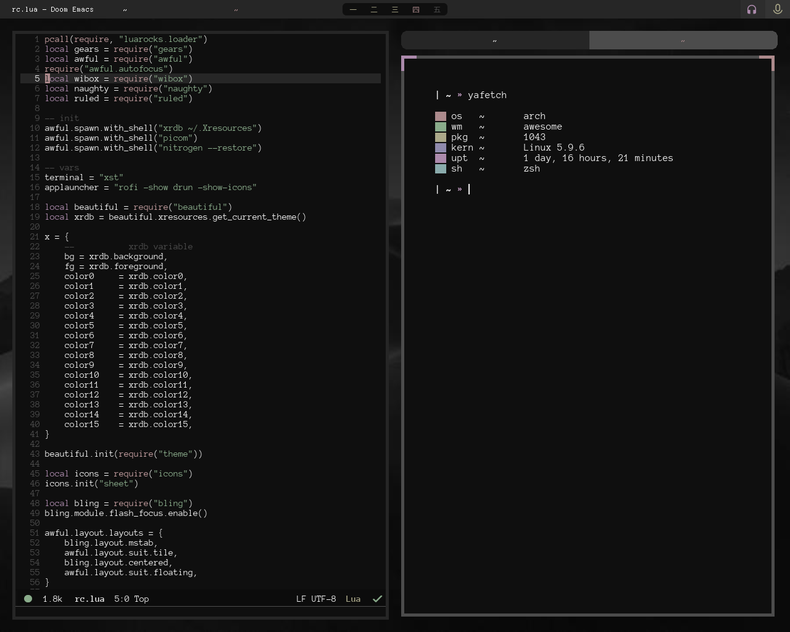

 
    

# Introduction

This repository contains my personal collection of configuration files.

I use the software above:

Window manager: [awesome](https://awesomewm.org)  
Text editor: [doom-emacs](https://github.com/hlissner/doom-emacs)  
Web browser: [firefox](https://www.mozilla.org/en-US/firefox/)  
Terminal: [simple-terminal](https://st.suckless.org/)  
Shell: [zsh](https://github.com/ohmyzsh/ohmyzsh)  
File manager: [thunar](https://git.xfce.org/xfce/thunar/) [fff](https://github.com/dylanaraps/fff)  

