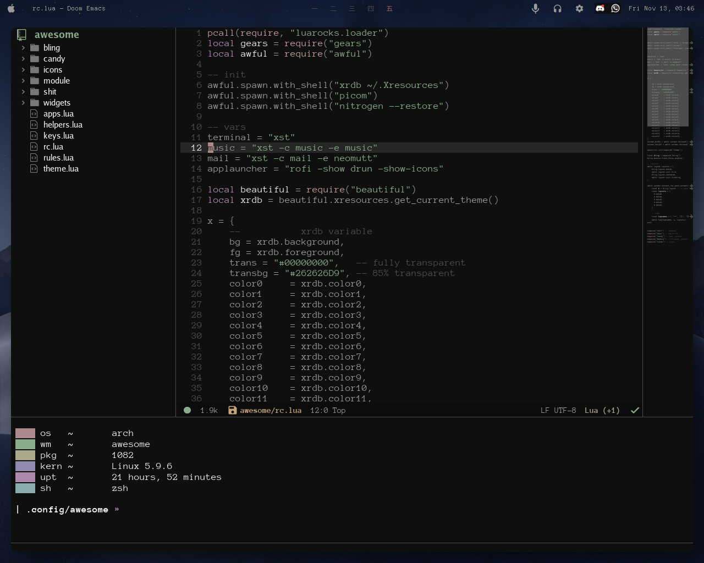
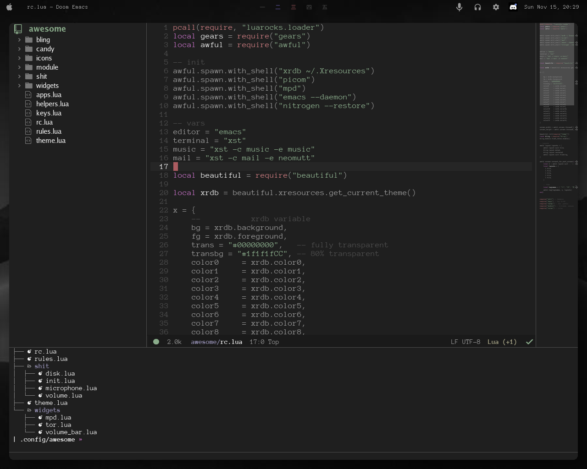
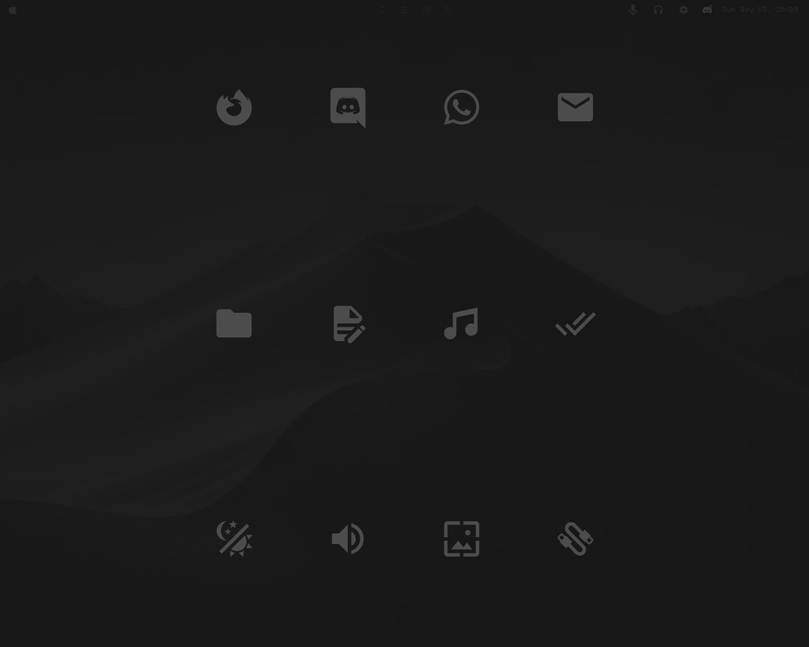
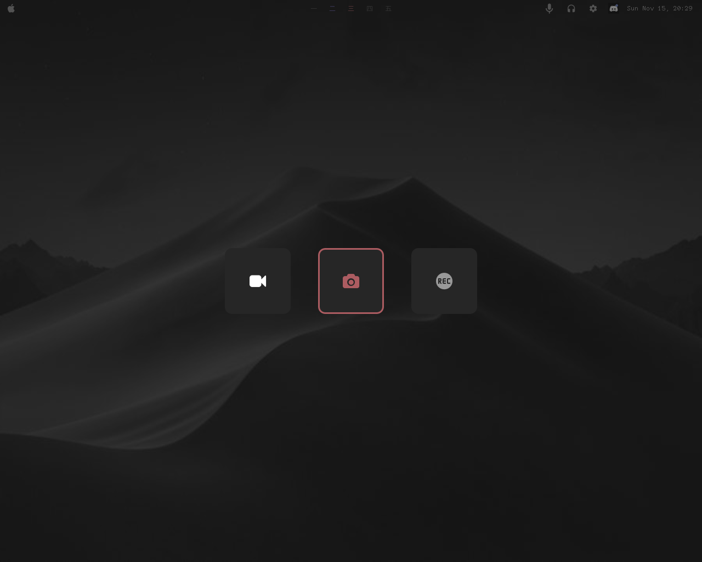

<p align="center"></p>
<p align="center"> 
    <a href="#introduction">  </a>
    <a href="#setup">  </a>
    <a href="#gallery">  </a>
</p>

# Introduction

This repository contains my personal collection of configuration files linux.  
Inspired by elena's [dotfiles](https://github.com/elenapan/dotfiles) and JavaCafe01's [dotfiles](https://github.com/JavaCafe01/dotfiles)  

I'm distro hopping a lot and i got tired of copying my dotfiles so i ended up here.


I use the software above:

**Window Manager**: [awesome](https://awesomewm.org)  
**Text editor**: [doom-emacs](https://github.com/hlissner/doom-emacs)  
**Web browser**: [firefox](https://www.mozilla.org/en-US/firefox/)  
**Terminal**: [simple-terminal](https://st.suckless.org/)  
**Shell**: [zsh](https://github.com/ohmyzsh/ohmyzsh)  
**File manager**: [thunar](https://git.xfce.org/xfce/thunar/) [fff](https://github.com/dylanaraps/fff)  
**Music player**: [ncmpcpp](https://github.com/ncmpcpp/ncmpcpp)  
**Email client**: [neomutt](https://github.com/neomutt/neomutt)  

# Setup

1. Install awesome

    You need the git version, otherwise you can't use my setup
 
     ```sh
     yay -S awesome-git 
     ```
 
2. Install my awesomewm configuration

    First back up your current config
    ```sh
    mv ~/.config/awaesome ~/.config/awesome-backup
    ```
    Clone this repository
    
    ```sh 
    git clone https://github.com/yrwq/dotfiles && cd dotfiles
    ```
    
    Now copy my files
    ```sh
    cp config/awesome ~/.config/ -r 
    ```
    
3. Install [bling](https://github.com/Nooo37/bling) (utilities for awesomewm)
   
   This is optional, but if you don't wanna use bling you should edit `rc.lua`
   
    ```sh
    git clone https://github.com/Nooo37/bling ~/.config/awesome -r
    ```

4. Install scripts, wallpapers, etc. (optional)

    Before copying my scripts take a look at bin's [readme](https://github.com/yrwq/dotfiles/blob/main/bin/README.org)

    ```sh
    cp bin ~/.bin -r
    ```
    
    Copy wallpapers
    
    ```sh
    cp wp ~/.wp -r
    ```
    
    Copy fonts
    
    ```sh
    cp fonts ~/.fonts/ -r 
    ```
    
    Before using my config you should change the default applications, in `rc.lua` and `apps.lua`
    
    
# Gallery





