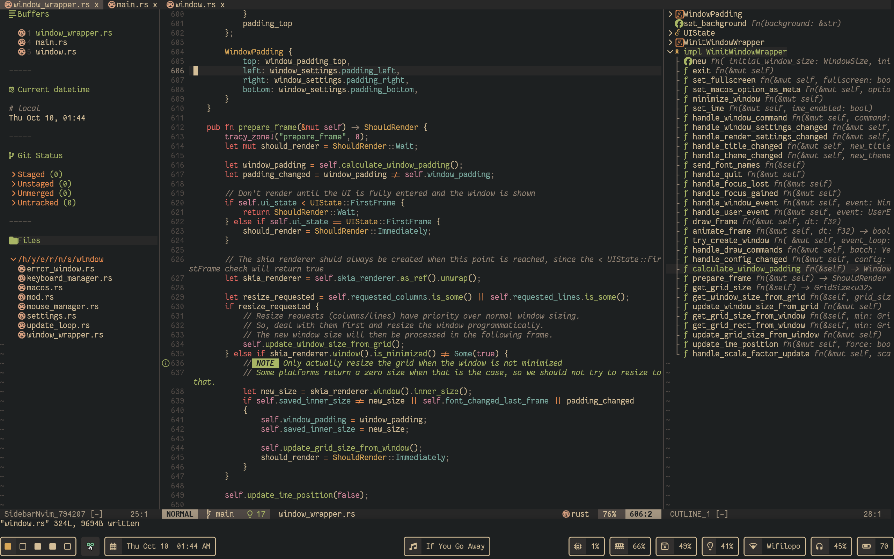
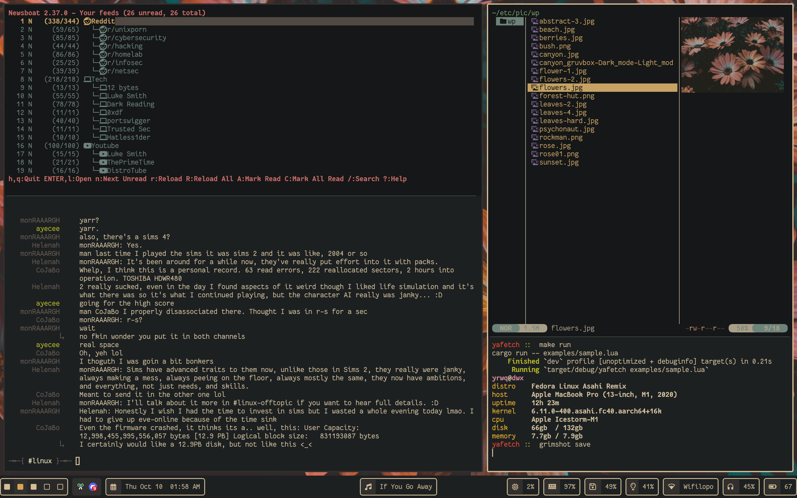

This repository contains my personal collection of configuration files for the [software i use](https://yrwq.neocities.org/software).

## preview

### neovim

### firefox, discord, emacs

### newsboat, weechat, yazi, yafetch

